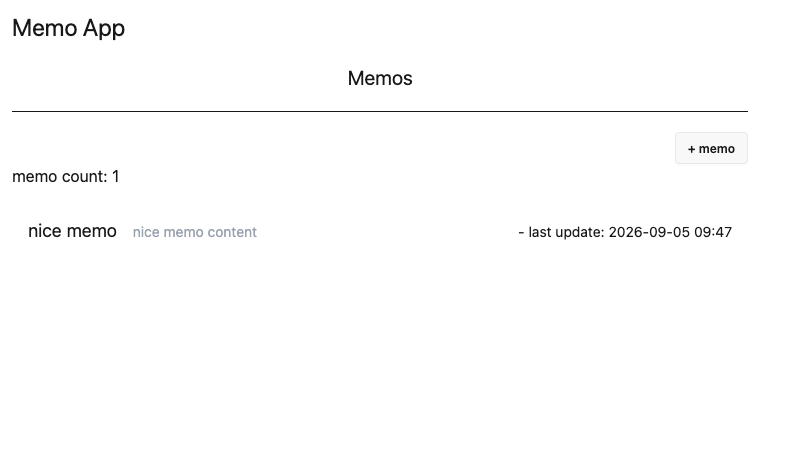
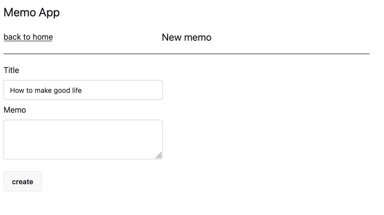
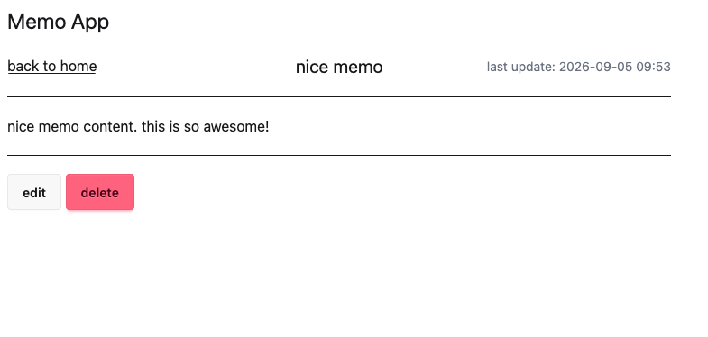
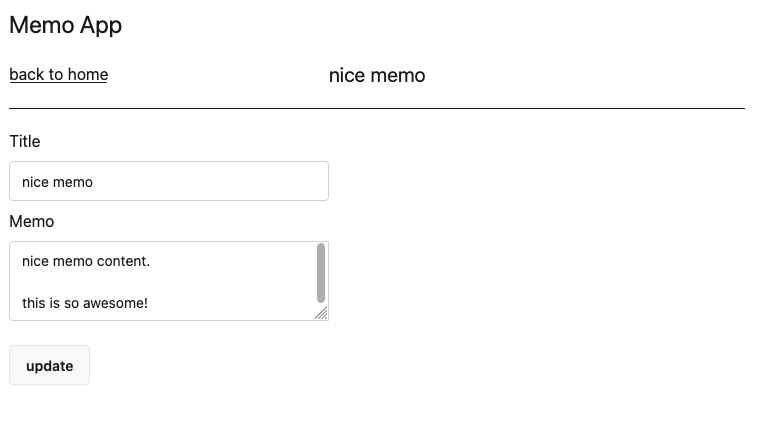
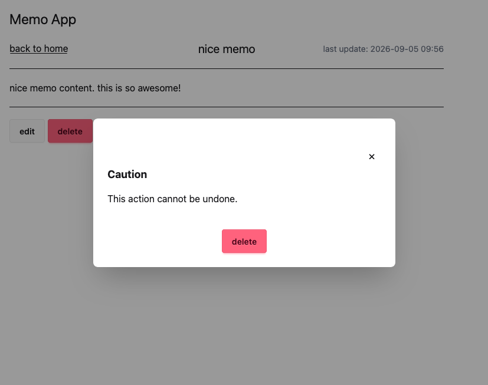

## sinatra-memo-practice
Ruby の軽量Webアプリケーションライブラリ [Sinatra](https://sinatrarb.com/) を使ったアプリ開発の学習・練習用リポジトリ

## Prerequisites
- Bundler
- rbenv
- rubocop

## Setup
1. clone this repository
    - `git clone`
2. prepare Ruby env
    - `rbenv install`
3. install gems
    - `bundle install`

## Commands

### Run App
```sh
bundle exec puma config.ru -p 4567
```
Visit [http://localhost:4567/](http://localhost:4567/).

Memos are stored in `memos.csv` in the project root. It is created automatically if it does not exist.

Puma's default port is `9292`; use `-p` to specify a different port.


### Lint / Format
- using `erb_lint`
```sh
bundle exec erb_lint --lint-all
```

- using `rubocop`, rule: `.rubocop.yml`
```sh
bundle exec rubocop
```

## Web UI Screenshot
### Home

### Create


### Detail


### Edit


### Delete


## API
REST-based JSON API is available under `/api`.
### Response

```json
{
  "result": "success",
  "body": ...
}
```

or, on error:

```json
{
  "result": "error",
  "message": ...
}
```

### Memo structure

|Parameter|Type|Desc|
|--|--|--|
|id|string|UUID v4|
|title|string|required|
|content|string|required|
|created_at|datetime|`YYYY-MM-DD HH:mm:SS +ZZZZ`|
|updated_at|datetime|`YYYY-MM-DD HH:mm:SS +ZZZZ`|

### GET /api/memos
List all memos.
```sh
curl localhost:4567/api/memos
```

Example response on success:
```json
{
  "result": "success",
  "body": [
    {
      "id": "429a4196-...",
      "title": "memo title",
      "content": "...",
      "created_at": "2007-08-09 12:34:56 +0900",
      "updated_at": "2007-08-09 12:34:56 +0900"
    },
    {
      "id": "7c83a067-...",
      "title": "memo title 2",
      "content": "...",
      "created_at": "2007-08-09 12:34:56 +0900",
      "updated_at": "2007-08-09 12:34:56 +0900"
    }
  ]
}
```

### POST /api/memos
Create a new memo. Requires `title` and `content`.

```sh
# simple example
curl -v -d 'title=this is new title&content=this is new content' localhost:4567/api/memos
```

Response example:
```json
{"result":"success","body":{"id":"41a5b846-8e94-4f8b-829c-e3817dbb971c","title":"this is new title","content":"this is new content","created_at":"2026-09-05 10:31:35 +0900","updated_at":"2026-09-05 10:31:35 +0900"}}
```


### GET /api/memos/:memo_id
Get a memo.

```sh
curl -v localhost:4567/api/memos/429a4196-xxxx-xxxx-xxxx-xxxxxxxxxxxx
```

### PATCH /api/memos/:memo_id
Update an existing memo. Requires `title` and `content`.
Returns `204 No Content` on success, `404` if the memo does not exist.
```sh
curl -X PATCH \
  -v -d 'title=update title&content=update content' \
  http://localhost:4567/api/memos/429a4196-xxxx-xxxx-xxxx-xxxxxxxxxxxx
```

### DELETE /api/memos/:memo_id
Delete a memo. Returns `204 No Content` on success, `404` if the memo does not exist.

```sh
curl -v -X DELETE \
  localhost:4567/memos/1eae8de8-xxxx-xxxx-xxxx-xxxxxxxxxxxx
```

## References
- sinatra [Command Line](https://github.com/sinatra/sinatra#command-line)
- rack-unreloader https://github.com/jeremyevans/rack-unreloader
